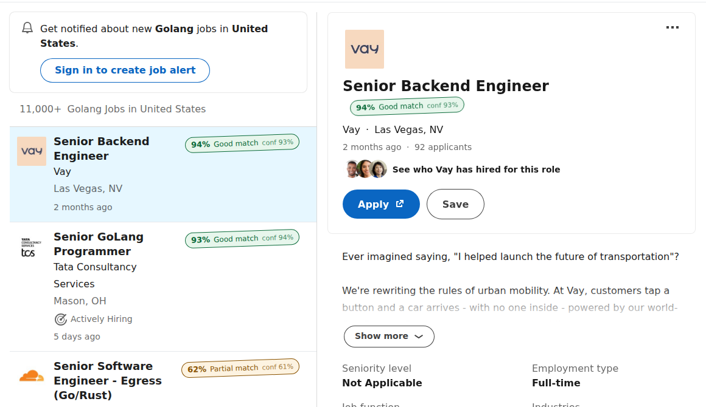
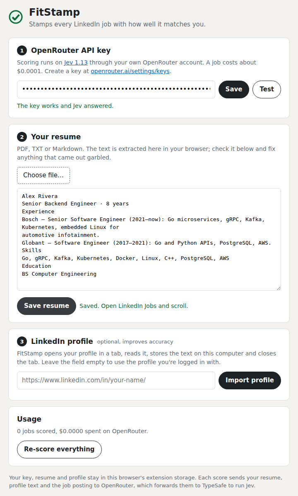

# FitStamp

A Chrome extension that stamps every job on LinkedIn with how well it matches your resume. Scroll the jobs list and each card gets a match percentage and a confidence score as it comes into view.



Scoring runs on [Jev 1.13](https://docs.typesafe.ai/concepts/system-one) by TypeSafe, with your own API key from either [OpenRouter](https://openrouter.ai/typesafe/jev-1.13) or [TypeSafe](https://console.typesafe.ai) directly. Jev is a decision model: it doesn't write text, it answers typed questions with calibrated probabilities, so a score comes back in under a second and costs about **$0.0001 per job** (roughly 10,000 jobs per dollar).

## How it works

1. You give the extension your resume (PDF, TXT or Markdown) and an OpenRouter or TypeSafe API key. Importing your LinkedIn profile is optional and adds whatever the resume leaves out.
2. On `linkedin.com/jobs/*`, each job card that scrolls into view is picked up, and so is the job you have open in the right-hand pane (its stamp sits under the title). The extension downloads the full posting from LinkedIn's public job page (the same one a logged-out visitor sees), so it scores the whole description and not just the title.
3. Your resume, profile and the posting go to Jev in one request with three questions:
   - **fit**: a 0–3 score, from "no meaningful overlap" to "meets nearly all requirements and the seniority fits"
   - **requirements**: the probability that you meet the hard requirements (years, required tech, degrees, certifications)
   - **seniority**: the probability that the level is right for you
4. The extension combines them into one number (60% fit, 25% requirements, 15% seniority) and stamps the card:

   | Stamp | Match |
   | --- | --- |
   | 🟢 **Good match** | 70% or more |
   | 🟠 **Partial match** | 45–69% |
   | 🔴 **Weak match** | under 45% |

   `conf` is how sure Jev is about the fit score: 90% means the answer was clear-cut, 50% means the posting sits between two levels. Hover a stamp to see the three answers behind it. A dashed border means the full posting couldn't be read and the score is based on the card alone.

Scores are cached for 7 days per job. Changing your resume or profile re-scores everything automatically.

## Install (step by step)

The extension isn't on the Chrome Web Store, so you load it from this folder. It takes about two minutes.

### 1. Get an API key (OpenRouter or TypeSafe)

You need one key, from either of these. Both run the same model at the same price; pick whichever account you already have.

| | OpenRouter | TypeSafe |
| --- | --- | --- |
| Where requests go | OpenRouter, which forwards them to TypeSafe | Straight to TypeSafe's API |
| Billing | Your OpenRouter credits | Your TypeSafe account |
| Get a key | [openrouter.ai/settings/keys](https://openrouter.ai/settings/keys) | [console.typesafe.ai/keys](https://console.typesafe.ai/keys) |

**OpenRouter:** sign in at [openrouter.ai](https://openrouter.ai), add a few dollars at [openrouter.ai/settings/credits](https://openrouter.ai/settings/credits) ($1 covers thousands of jobs), then click **Create key** at [openrouter.ai/settings/keys](https://openrouter.ai/settings/keys) and copy it (it starts with `sk-or-v1-`). You can set a credit limit on the key if you want a hard cap.

**TypeSafe:** sign in at [console.typesafe.ai](https://console.typesafe.ai) and create a key at [console.typesafe.ai/keys](https://console.typesafe.ai/keys).

### 2. Download the extension

With git:

```bash
git clone https://github.com/edumntg/fitstamp.git
```

Or on the GitHub page click **Code → Download ZIP** and unzip it. Remember where the `fitstamp` folder is.

### 3. Load it in Chrome

1. Open `chrome://extensions` in the address bar.
2. Turn on **Developer mode** (switch at the top right).
3. Click **Load unpacked** and pick the `fitstamp` folder (the one that contains `manifest.json`).
4. FitStamp appears in the list and its settings page opens by itself.
5. Optional: click the puzzle icon in the toolbar and pin FitStamp so the icon is always visible.

It works the same in Edge, Brave and other Chromium browsers (`edge://extensions`, `brave://extensions`).

### 4. Set it up



1. **API key**: choose **OpenRouter** or **TypeSafe**, paste the key, click **Save**, then **Test**. You should see "The key works and Jev answered through …". The extension uses whichever provider is selected when you save; each provider's key is kept, so you can switch back and forth.
2. **Your resume**: click **Choose file…** and pick your resume. The extracted text appears in the box; read it over, fix anything garbled and click **Save resume**. If your PDF is a scanned image no text will come out; paste the text into the box instead.
3. **LinkedIn profile** (optional, improves accuracy): paste your profile link (`https://www.linkedin.com/in/your-name/`) or leave it empty to use the account you're logged into, then click **Import profile**. A tab opens on your profile and steps through its section pages (experience, education, certifications, skills, projects, courses, languages), then closes; it takes about half a minute. It keeps your name, headline, location, About, top skills, featured posts and those sections, and leaves out everything else on the page: analytics, suggestions, other people's profiles, the footer. Click **See what was captured** to check it. You need to be logged in to LinkedIn in the same browser.

### 5. Use it

1. Open [LinkedIn Jobs](https://www.linkedin.com/jobs/collections/recommended/) or run any job search.
2. Scroll. Each card shows **Scoring…** and within a second or two gets its stamp.
3. Hover a stamp for the details. Click the toolbar icon to pause FitStamp or see how much you've spent.

## Updating

Pull the latest code (`git pull`, or download the ZIP again), then open `chrome://extensions` and click the reload arrow on FitStamp. Refresh any open LinkedIn tabs.

## Troubleshooting

| What you see | What to do |
| --- | --- |
| No stamps at all | Refresh the LinkedIn tab after installing or reloading the extension. Check the toolbar popup: key and resume must both be ticked, and the **On** switch enabled. |
| A dark box at the bottom right saying FitStamp can't score | It tells you what's missing (key, resume, rejected key, no credits). Click **Open settings**. |
| **FitStamp: error** on a card | Hover it for the message. Usually a network hiccup; **Re-score everything** in settings retries. |
| Stamps with a dashed border | LinkedIn rate-limited the posting download, so the score uses the card only. The extension backs off and keeps going. |
| Stamps stopped appearing after a LinkedIn update | LinkedIn changes its page layout often. Open an issue with a screenshot; card detection lives in `findCards()` and the open-job pane in `findDetail()`, both in `src/content/jobs.js`. |
| Scores seem off for a non-English resume | Jev is trained mainly on English. An English version of your resume scores more accurately. |

## Privacy

- Your API key(s), resume text, profile text and the score cache are kept in the extension's local storage in your browser. Nothing is synced or sent to any server of ours; there isn't one.
- Each score sends your resume, your profile text (if imported) and the job posting to the provider you picked: OpenRouter (which forwards them to TypeSafe) or TypeSafe directly. See [OpenRouter's privacy policy](https://openrouter.ai/privacy) and [TypeSafe's legal page](https://docs.typesafe.ai/legal). If you'd rather not send a detail (phone number, home address), delete it from the resume text in settings before saving; it doesn't help the match anyway.
- Job postings are downloaded from LinkedIn's public job pages without your session cookie, so the extension doesn't act on your account. Reading LinkedIn pages with an extension is still something LinkedIn's terms discourage; use it at your own discretion.

## Project layout

```
manifest.json            Chrome MV3 manifest
src/background.js        Service worker: score cache, Jev calls, profile import
src/lib/jev.js           The Jev request (state + questions), both providers, and how answers become a match %
src/content/jobs.js      Finds job cards, fetches postings, draws the stamps
src/content/jobs.css     Stamp styles
src/content/profile.js   Reads your profile page during an import
src/options/             Settings page (key, resume, profile)
src/popup/               Toolbar popup
vendor/pdfjs/            pdf.js 6.3 (Apache-2.0) for reading PDF resumes in the browser
```

To change what "a good match" means, edit `QUESTIONS` and `combine()` in `src/lib/jev.js`. There's no build step: edit, reload the extension, refresh LinkedIn.
